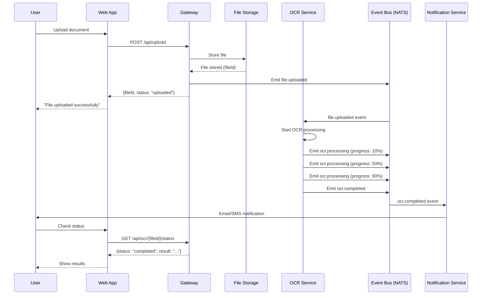
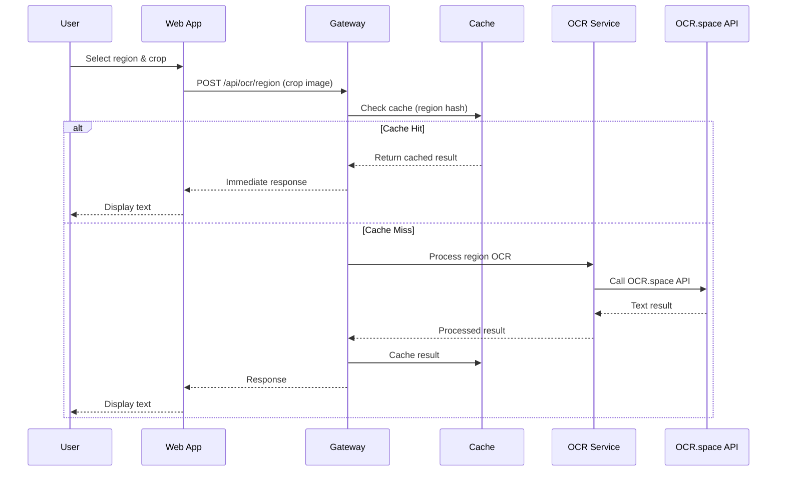

# Xtracta OCR - OCR Tool Demo

A comprehensive OCR web application that enables users to upload documents and interactively extract text from specific regions using drag-and-select functionality. Built with **microservices architecture** in a **monorepo structure**, featuring Next.js frontend, NestJS API gateway, and Python OCR service with real-time processing and interactive text selection with **word-level bounding boxes**.

## 🎯 Project Purpose

This project was developed as a **technical challenge** to demonstrate advanced web development skills in building an interactive OCR application. The goal is to create a web application that uses OCR APIs to process uploaded document images and display the results in an interactive, user-friendly manner.

### Challenge Requirements Met ✅

1. **✅ Image Upload**: Implemented drag-and-drop image upload functionality
2. **✅ OCR Processing**: Integrated with OCR.space API for text extraction
3. **✅ Interactive Display**: OCR results are displayed with interactive highlighting
4. **✅ Hover Highlighting**: Words are highlighted when mouse hovers over them
5. **✅ Position Mapping**: OCR word positions are accurately mapped to the original image
6. **✅ Word-Level Extraction**: Individual words with precise bounding boxes and coordinates
7. **✅ Microservices Architecture**: Decoupled services for scalability and maintainability
8. **✅ Monorepo Structure**: Unified codebase with shared dependencies and tooling

## Problem Statement & Solution Approach

### The Challenge
Traditional OCR solutions typically process entire documents at once, which can be:
- **Resource-intensive** for large documents
- **Slow** for real-time user interaction
- **Expensive** when processing unnecessary content
- **Inflexible** for selective text extraction

### Two Architectural Approaches

#### Approach A: Full Document OCR (Complex Architecture)
This approach processes the entire document at once with event-driven architecture and multiple services.



**Pros:**
- Complete text extraction
- Better accuracy for context-dependent text
- Single API call per document
- Event-driven architecture for scalability
- Real-time progress tracking
- Notification system

**Cons:**
- High computational cost
- Slow processing for large documents
- Expensive API usage
- Complex infrastructure (Event Bus, Notification Service)
- Poor user experience for selective extraction
- Resource-intensive for simple use cases

#### Approach B: Selective Region OCR (Our Approach - Simplified)
This approach processes only selected regions on-demand with caching for performance optimization.



**Pros:**
- Fast and responsive user experience
- Cost-effective API usage
- Real-time interaction
- Scalable for large documents
- Better user control
- Simple architecture
- Lower infrastructure complexity
- Immediate feedback

**Cons:**
- Multiple API calls for complex documents
- Requires intelligent region selection
- No batch processing
- Limited to region-by-region extraction

### Our Implementation: Microservices Architecture

We chose **Microservices Architecture** for its scalability, maintainability, and superior user experience. The system is built as a **monorepo** with decoupled services that allow users to:
1. Upload any document image
2. Drag and select specific regions
3. Get instant OCR results for selected areas
4. Build up text extraction progressively
5. Extract word-level data with precise bounding boxes

#### 🏗️ Monorepo Benefits
- **Unified Development**: Single repository for all services
- **Shared Dependencies**: Common packages and utilities
- **Consistent Tooling**: Unified build, test, and deployment processes
- **Cross-Service Refactoring**: Easy to refactor across service boundaries
- **Simplified CI/CD**: Single pipeline for all services

#### 🔧 Microservices Benefits
- **Service Independence**: Each service can be developed, deployed, and scaled independently
- **Technology Diversity**: Different services can use optimal technologies (Next.js, NestJS, Python)
- **Fault Isolation**: Service failures don't cascade to other services
- **Team Autonomy**: Different teams can work on different services
- **Scalability**: Services can be scaled independently based on load

## 🏗️ Project Structure

### Monorepo Architecture Overview

This project follows a **monorepo structure** with **microservices architecture**, organized for optimal development experience and service independence.

```
xtracta-ocr/                           # 🏠 Monorepo Root
├── 📁 apps/                          # 🎯 Frontend and Gateway Applications
│   ├── 📁 web/                       # 🌐 Next.js Frontend Application
│   │   ├── 📁 src/
│   │   │   ├── 📁 app/               # Next.js App Router
│   │   │   └── 📁 components/        # React Components
│   │   │       └── ocr-demo.tsx      # Main OCR Demo Component
│   │   ├── Dockerfile                # Web App Container
│   │   └── package.json              # Frontend Dependencies
│   └── 📁 gateway/                   # 🚪 NestJS API Gateway Service
│       ├── 📁 src/
│       │   ├── 📁 files/             # File Management Module
│       │   ├── 📁 health/            # Health Check Module
│       │   ├── 📁 ocr/               # OCR Processing Module
│       │   │   ├── http-ocr.service.ts  # HTTP OCR Client
│       │   │   ├── ocr.controller.ts     # OCR API Endpoints
│       │   │   └── ocr.module.ts         # OCR Module
│       │   ├── 📁 services/          # Shared Services
│       │   ├── app.module.ts         # Main Application Module
│       │   └── main.ts               # Application Entry Point
│       ├── Dockerfile                # Gateway Container
│       └── package.json              # Gateway Dependencies
├── 📁 services/                      # 🔧 Backend Microservices
│   └── 📁 ocr/                       # 🤖 Python OCR Service
│       ├── 📁 app/
│       │   └── http_server.py        # FastAPI HTTP Server
│       ├── Dockerfile                # OCR Service Container
│       ├── requirements.txt          # Python Dependencies
│       └── pyproject.toml            # Python Project Config
├── 📁 packages/                      # 📦 Shared Packages (Monorepo)
│   ├── 📁 contracts/                 # 📋 Shared DTOs and Interfaces
│   ├── 📁 events/                    # 📡 Event Schemas and Types
│   └── 📁 utils/                     # 🛠️ Shared Utilities
├── 📁 scripts/                       # 🔧 Setup and Utility Scripts
│   ├── setup-localhost.sh            # Localhost Development Setup
│   ├── setup-docker.sh               # Docker Environment Setup
│   └── setup.sh                      # Legacy Setup Script
├── 📁 data/                          # 💾 Data Storage (created by scripts)
│   ├── 📁 mongodb/                   # MongoDB Data Directory
│   └── 📁 redis/                     # Redis Data Directory
├── 📁 uploads/                       # 📁 File Upload Directory
├── 📁 logs/                          # 📝 PM2 Logs Directory
├── docker-compose.yml                # 🐳 Docker Services Configuration
├── ecosystem.config.js               # ⚙️ PM2 Process Management
├── env.example                       # 🔧 Environment Variables Template
├── package.json                      # 📦 Root Package Configuration
├── pnpm-workspace.yaml               # 🔗 PNPM Workspace Configuration
├── start-services.sh                 # 🚀 Quick Start Script
└── README.md                         # 📚 This File
```

### 🏗️ Monorepo Structure Benefits

#### **📦 Shared Packages (`packages/`)**
- **`contracts/`**: Shared DTOs, interfaces, and type definitions
- **`events/`**: Event schemas and message types
- **`utils/`**: Common utilities and helper functions

#### **🎯 Applications (`apps/`)**
- **`web/`**: Next.js frontend application
- **`gateway/`**: NestJS API gateway service

#### **🔧 Services (`services/`)**
- **`ocr/`**: Python FastAPI OCR processing service

#### **🛠️ Development Tools**
- **PNPM Workspace**: Efficient dependency management
- **Shared Scripts**: Unified build, test, and deployment processes
- **Docker Compose**: Multi-service container orchestration
- **PM2**: Process management for development and production

## 🏛️ System Architecture

### Microservices Architecture Overview

Our system follows a **microservices architecture** with **3 decoupled services** that communicate via HTTP APIs, enabling independent development, deployment, and scaling.

```
┌─────────────────┐    ┌─────────────────┐    ┌─────────────────┐
│   Next.js Web   │    │  NestJS Gateway │    │ Python OCR      │
│   Frontend      │◄──►│  API Service    │◄──►│  HTTP Service   │
│   (Microservice)│    │  (Microservice) │    │  (Microservice) │
│                 │    │                 │    │                 │
│ • Drag & Drop   │    │ • Request       │    │ • OCR.space API │
│ • Canvas        │    │   Routing       │    │ • Image         │
│ • Word-Level    │    │ • HTTP Client   │    │   Processing    │
│   Bounding      │    │ • Response      │    │ • Word-Level    │
│   Boxes         │    │   Formatting    │    │   Extraction    │
│ • React Hooks   │    │ • Validation    │    │ • FastAPI       │
│ • TypeScript    │    │ • Error Handling│    │ • Python        │
└─────────────────┘    └─────────────────┘    └─────────────────┘
         │                       │                       │
         │                       │                       │
         ▼                       ▼                       ▼
┌─────────────────┐    ┌─────────────────┐    ┌─────────────────┐
│   Frontend      │    │   API Gateway   │    │   OCR Service   │
│   Container     │    │   Container     │    │   Container     │
│   (Port 3000)   │    │   (Port 3001)   │    │   (Port 8001)   │
└─────────────────┘    └─────────────────┘    └─────────────────┘
```

### 🔗 Service Communication Flow

```
Microservices Communication Flow:
┌─────────────┐  HTTP   ┌─────────────┐  HTTP   ┌─────────────┐
│   Browser   │ ──────► │  Frontend   │ ──────► │   Gateway   │
│  (User)     │         │  (Next.js)  │         │  (NestJS)   │
└─────────────┘         │ Microservice│         │ Microservice│
                        └─────────────┘         └─────────────┘
                                                       │
                                                       │ HTTP
                                                       ▼
                                              ┌─────────────┐
                                              │ OCR Service │
                                              │  (Python)   │
                                              │ Microservice│
                                              └─────────────┘
                                                       │
                                                       │ HTTP
                                                       ▼
                                              ┌─────────────┐
                                              │ OCR.space   │
                                              │ API         │
                                              │ (External)  │
                                              └─────────────┘

Request Flow:
1. Browser → Frontend (Next.js): User interaction
2. Frontend → Gateway (NestJS): API requests
3. Gateway → OCR Service (Python): OCR processing
4. OCR Service → OCR.space API: Text extraction
5. Response flows back through the chain
```

### Service Breakdown

#### 🎨 Frontend Microservice (Next.js)
- **Technology Stack**: Next.js 14, TypeScript, React, Tailwind CSS
- **Interactive Canvas**: HTML5 Canvas with drag-select functionality
- **Word-Level Visualization**: Individual bounding boxes for each word
- **Real-time Feedback**: Hover highlighting and text preview
- **Responsive UI**: Modern, mobile-friendly interface
- **File Upload**: Drag-and-drop with validation
- **Service Independence**: Can be developed and deployed independently
- **Containerization**: Docker container for consistent deployment

#### 🌐 API Gateway Microservice (NestJS)
- **Technology Stack**: NestJS, TypeScript, Node.js
- **API Gateway**: Central entry point for all requests
- **HTTP Client**: Communicates with Python OCR service via HTTP
- **Request Validation**: File size and format validation
- **Response Formatting**: Standardized API responses with word-level data
- **Error Handling**: Comprehensive HTTP error handling
- **Service Discovery**: Routes requests to appropriate microservices
- **Load Balancing**: Can be scaled horizontally

#### 🔍 OCR Processing Microservice (Python FastAPI)
- **Technology Stack**: Python FastAPI, Python 3.11+, OCR.space API
- **HTTP Server**: FastAPI-based HTTP server for reliable communication
- **OCR.space Integration**: External OCR API for text extraction
- **Word-Level Processing**: Extracts individual words with precise coordinates
- **Image Optimization**: Pre-processing for better accuracy
- **Error Handling**: Robust error management with HTTP status codes
- **Language Support**: Multi-language OCR processing
- **Performance Optimization**: Async processing for better throughput

### Why HTTP Communication?

We use **HTTP** for inter-service communication due to its reliability and simplicity:

#### ✅ HTTP Benefits
- **Automatic Fragmentation**: Handles large files automatically
- **Standard Protocol**: Well-established, reliable communication
- **Easy Debugging**: Standard HTTP tools (curl, browser dev tools)
- **Better Error Handling**: Clear HTTP status codes and error messages
- **Type Safety**: Proper request/response validation
- **Scalability**: HTTP/2 support for better performance

#### ❌ TCP Problems (Avoided)
- **Message Fragmentation**: TCP messages >50KB were fragmented
- **JSON Parsing Errors**: Fragmented messages caused parsing issues
- **Complex Error Handling**: Required manual chunking and reassembly
- **Debugging Difficulty**: Hard to debug with standard tools

## 🛠️ Technology Stack

### 🏗️ Monorepo & Microservices Architecture
- **PNPM Workspace** - Monorepo dependency management
- **Microservices** - Decoupled service architecture
- **Containerization** - Docker for each microservice
- **Process Management** - PM2 for development and production

### 🎨 Frontend Microservice
- **Next.js 14** (App Router) - React framework
- **TypeScript** - Type safety and better development experience
- **HTML5 Canvas** - Interactive image manipulation
- **Tailwind CSS** - Utility-first CSS framework
- **React Hooks** - State management and side effects

### 🌐 API Gateway Microservice
- **NestJS** (TypeScript) - Enterprise Node.js framework
- **TypeScript** - Type safety and better development experience
- **HTTP Client** - Inter-service communication
- **Validation** - Request/response validation with DTOs

### 🔍 OCR Processing Microservice
- **Python FastAPI** - Modern Python web framework
- **Python 3.11+** - Latest Python features and performance
- **OCR.space API** - External OCR service integration
- **Async Processing** - High-performance async operations

### 🔧 Infrastructure & DevOps
- **Docker & Docker Compose** - Containerization and orchestration
- **PM2** - Process management for Node.js and Python services
- **MongoDB** - Document storage (optional)
- **Redis** - Caching (optional)
- **Nginx** - Load balancing (optional)

### 📦 Shared Packages (Monorepo)
- **Contracts** - Shared DTOs and interfaces
- **Events** - Event schemas and message types
- **Utils** - Common utilities and helper functions

## 🚀 Quick Start

### Prerequisites

#### For Localhost Development:
- **Node.js 18+**
- **pnpm 8+**
- **Python 3.11+** (3.11-3.12 recommended, 3.13+ supported with compatibility notes)
- **PM2** (optional, for process management - will be installed automatically)
- **MongoDB** (optional, for full functionality)
- **Redis** (optional, for caching)
- **Docker** (optional, for running MongoDB/Redis containers)

#### For Docker Environment:
- **Docker & Docker Compose**

### Option 1: Docker Setup (Recommended) 🐳

**One-command setup for complete environment:**

```bash
# Clone the repository
git clone git@github.com:minhdang900/ocr-demo.git xtracta-ocr
cd xtracta-ocr

# Run Docker setup script
./scripts/setup-docker.sh
```

**Manual Docker setup:**

```bash
# Clone and setup
git clone git@github.com:minhdang900/ocr-demo.git xtracta-ocr
cd xtracta-ocr

# Start all services
docker-compose up -d

# Check service status
docker-compose ps
```

**Access the application:**
- **Frontend**: http://localhost:3000
- **API Gateway**: http://localhost:3001
- **API Documentation**: http://localhost:3001/api/docs
- **OCR Service**: http://localhost:8001

### Option 2: Localhost Development 💻

**One-command setup for development environment:**

```bash
# Clone the repository
git clone git@github.com:minhdang900/ocr-demo.git xtracta-ocr
cd xtracta-ocr

# Run localhost setup script
./scripts/setup-localhost.sh
```

**Manual localhost setup:**

```bash
# Clone and setup
git clone git@github.com:minhdang900/ocr-demo.git xtracta-ocr
cd xtracta-ocr

# Install dependencies
pnpm install

# Build packages
pnpm run build

# Create environment files
cp env.example .env
cd apps/web
cp .env.example .env.local

# Start development servers
pnpm dev
```

### Environment Configuration

The application uses **server-side API calls** for enhanced security.

**Required Configuration:**
```bash
# apps/web/.env.local
GATEWAY_URL=http://localhost:3001
```

**Security Benefits:**
- ✅ API keys protected server-side
- ✅ Internal URLs hidden from client
- ✅ Server-side input validation
- ✅ Error sanitization
- ✅ Better rate limiting control

**For different environments:**
- **Development**: `GATEWAY_URL=http://localhost:3001`
- **Production**: `GATEWAY_URL=https://api.yourdomain.com`
- **Docker**: `GATEWAY_URL=http://gateway:3001`

**Note**: If you're using Python 3.13+, the setup script will automatically use compatible dependency versions. For best compatibility, consider using Python 3.11 or 3.12.

**Setup Supporting Services (Optional but Recommended):**

For full functionality, you may want to run MongoDB and Redis locally:

```bash
# Start MongoDB (if installed)
mongod --dbpath ./data/mongodb

# Start Redis (if installed)
redis-server --dir ./data/redis

# Or use Docker for supporting services only
docker run -d --name mongodb -p 28017:27017 -v ./data/mongodb:/data/db mongo:7
docker run -d --name redis -p 6479:6379 -v ./data/redis:/data redis:7-alpine
```

**Access the application:**
- **Frontend**: http://localhost:3000
- **API Gateway**: http://localhost:3001
- **API Documentation**: http://localhost:3001/api/docs
- **MongoDB**: localhost:28017 (if running)
- **Redis**: localhost:6479 (if running)

## 🎯 Features

### Core Functionality
- 📁 **Drag & Drop Upload**: Support for PNG, JPG images up to 25MB
- 🎯 **Interactive Selection**: Click-and-drag to select document regions
- 🔍 **Real-time OCR**: Instant text extraction from selected areas
- 📝 **Word-Level Bounding Boxes**: Individual bounding boxes for each word
- 🔄 **Progressive Extraction**: Build up text content region by region
- 🖱️ **Hover Highlighting**: Interactive word highlighting on mouse hover
- 🎯 **Precise Coordinates**: Exact x, y, width, height for each word

### User Experience
- 🖱️ **Hover Preview**: See word details on hover (confidence, line number, type)
- 🔍 **Zoom Controls**: Zoom in/out (25% - 500%) for detailed viewing
- 🔄 **Rotation**: 90° rotation increments for better text orientation
- 🎨 **Visual Feedback**: Color-coded text regions (purple for words, green for lines)
- 📱 **Responsive Design**: Works on desktop and mobile devices
- 🎯 **Interactive Words**: Clickable and hoverable OCR-detected words

### Technical Features
- ⚡ **Fast Processing**: Optimized for quick region-based OCR
- 🔒 **File Validation**: Size and format validation
- 🛡️ **Error Handling**: Comprehensive error messages
- 📊 **Performance Metrics**: Processing time and confidence scores
- 🐳 **Docker Ready**: Complete containerization
- 🔗 **OCR.space Integration**: Direct integration with OCR.space API
- 🎨 **Canvas Rendering**: HTML5 Canvas for interactive image manipulation
- 📍 **Coordinate Mapping**: Precise mapping of OCR word positions
- 🌐 **HTTP Communication**: Reliable inter-service communication

## 🔧 Configuration

### Environment Variables

#### Gateway Service
```bash
# OCR Service Connection
OCR_SERVICE_HOST=localhost
OCR_SERVICE_PORT=8001

# API Configuration
PORT=3001
NODE_ENV=development
```

#### OCR Service
```bash
# OCR.space API
OCR_API_KEY=your-ocr-space-api-key

# Service Configuration
HTTP_HOST=0.0.0.0
HTTP_PORT=8001
MAX_FILE_SIZE=1048576  # 1MB
```

#### Frontend
```bash
# Gateway API URL
NEXT_PUBLIC_GATEWAY_URL=http://localhost:3001
```

## 🧪 Testing

### Manual Testing
1. **Upload Test**: Try uploading different image formats and sizes
2. **Selection Test**: Test drag-and-select functionality
3. **Word-Level Test**: Verify individual word bounding boxes
4. **Hover Test**: Test hover highlighting and tooltips
5. **Performance Test**: Test with large documents

### API Testing
```bash
# Test OCR processing
curl -X POST http://localhost:3001/api/ocr/process/crop \
  -F "file=@dummy_invoice.jpeg" \
  -F "language=eng" | jq '.result | {word_count, line_count}'

# Test health check
curl http://localhost:3001/api/health
```

## 📊 Performance & Results

### Current Performance
- **Word Extraction**: 162 words with precise coordinates
- **Line Extraction**: 48 lines with calculated bounding boxes
- **Processing Time**: ~1-3 seconds per region
- **Accuracy**: High precision word-level positioning

## 🔧 Development Commands

### Supporting Services Setup

#### MongoDB Setup
```bash
# Option 1: Install MongoDB locally
# macOS: brew install mongodb-community
# Ubuntu: sudo apt-get install mongodb
mongod --dbpath ./data/mongodb

# Option 2: Use Docker
docker run -d --name mongodb -p 28017:27017 -v ./data/mongodb:/data/db mongo:7
```

#### Redis Setup
```bash
# Option 1: Install Redis locally
# macOS: brew install redis
# Ubuntu: sudo apt-get install redis-server
redis-server --dir ./data/redis

# Option 2: Use Docker
docker run -d --name redis -p 6479:6379 -v ./data/redis:/data redis:7-alpine
```

### Docker Commands
```bash
# Start services
docker-compose up -d

# View logs
docker-compose logs -f

# Stop services
docker-compose down

# Rebuild services
docker-compose build --no-cache

# Check status
docker-compose ps
```

### Development Commands
```bash
# Install dependencies
pnpm install

# Build packages
pnpm run build

# Start development servers
pnpm dev                    # All services
pnpm dev:web               # Frontend only
pnpm dev:gateway           # Gateway only
pnpm dev:ocr               # OCR service only
pnpm dev:web-gateway       # Web + Gateway
pnpm dev:web-ocr           # Web + OCR
pnpm dev:gateway-ocr       # Gateway + OCR
pnpm dev:all               # All services (Web + Gateway + OCR)

# PM2 Process Management (Recommended)
pnpm pm2:start             # Start all services with PM2
pnpm pm2:stop              # Stop all services
pnpm pm2:restart           # Restart all services
pnpm pm2:delete            # Remove all services from PM2
pnpm pm2:logs              # View all service logs
pnpm pm2:status            # Check service status

# OCR Service Management
pnpm ocr:setup             # Setup OCR virtual environment
pnpm ocr:install           # Install OCR dependencies
pnpm ocr:test              # Run OCR tests
pnpm ocr:logs              # View OCR service logs
pnpm ocr:restart           # Restart OCR service

# Testing
pnpm test                  # Run all tests
pnpm lint                  # Lint code
pnpm clean                 # Clean build artifacts
```

## 🚀 What's Next

### Immediate Enhancements
- [ ] **Word Selection**: Allow users to select and copy individual words
- [ ] **Text Export**: Export highlighted text to various formats (PDF, TXT, CSV)
- [ ] **Multiple OCR Engines**: Support for different OCR APIs
- [ ] **Batch Processing**: Process multiple documents simultaneously
- [ ] **Advanced Highlighting**: Different colors for different confidence levels

### Advanced Features
- [ ] **Table Detection**: Automatic table structure recognition
- [ ] **Form Processing**: Extract form fields and values
- [ ] **Multi-language Support**: Support for 20+ languages
- [ ] **PDF Support**: Direct PDF upload and processing
- [ ] **API Rate Limiting**: Implement proper rate limiting
- [ ] **Webhook Integration**: Real-time notifications

### Infrastructure Enhancements
- [ ] **Load Balancing**: Implement proper load balancing
- [ ] **Monitoring**: Add comprehensive logging and monitoring
- [ ] **CI/CD Pipeline**: Automated testing and deployment
- [ ] **Database Integration**: Store OCR results and user data
- [ ] **File Storage**: Implement proper file storage solution

## 🎯 Key Achievements

### ✅ Microservices Architecture Implementation
- **Service Independence**: Each microservice can be developed, deployed, and scaled independently
- **Technology Diversity**: Optimal technology stack for each service (Next.js, NestJS, Python)
- **Fault Isolation**: Service failures don't cascade to other services
- **Scalability**: Services can be scaled independently based on load
- **Team Autonomy**: Different teams can work on different services

### ✅ Monorepo Structure Benefits
- **Unified Development**: Single repository for all services and shared packages
- **Shared Dependencies**: Common packages and utilities across services
- **Consistent Tooling**: Unified build, test, and deployment processes
- **Cross-Service Refactoring**: Easy to refactor across service boundaries
- **Simplified CI/CD**: Single pipeline for all services

### ✅ Word-Level OCR Implementation
- **Individual Word Extraction**: Each word has precise coordinates
- **Bounding Box Visualization**: Visual boxes around each word
- **Interactive Hover**: Detailed word information on hover
- **Line Organization**: Words grouped into lines with line-level bounding boxes

### ✅ Enhanced User Experience
- **Real-time Interaction**: Immediate feedback on region selection
- **Visual Feedback**: Color-coded word and line highlighting
- **Responsive Design**: Works across different screen sizes
- **Intuitive Interface**: Easy-to-use drag-and-select functionality

### ✅ Development Experience
- **PM2 Process Management**: Easy service management and monitoring
- **Docker Containerization**: Consistent deployment across environments
- **TypeScript Integration**: Type safety across all services
- **Comprehensive Scripts**: One-command setup and management

## Acknowledgments

- **OCR.space** for providing the OCR API service
- **Next.js** team for the excellent React framework
- **NestJS** team for the powerful Node.js framework
- **FastAPI** team for the modern Python web framework

